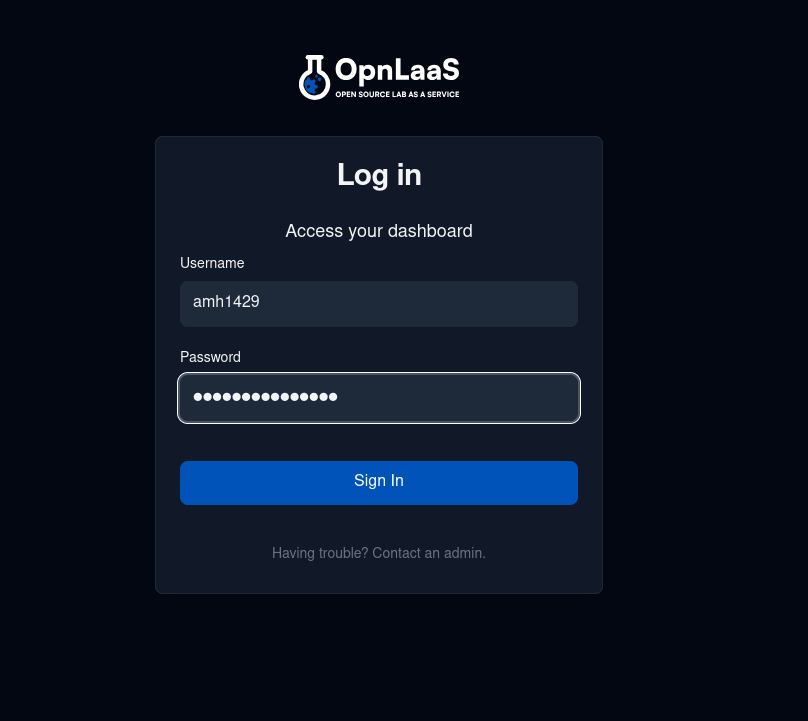
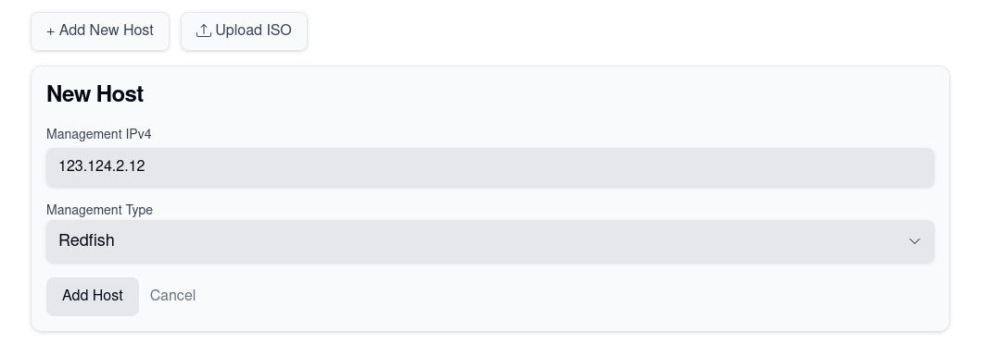
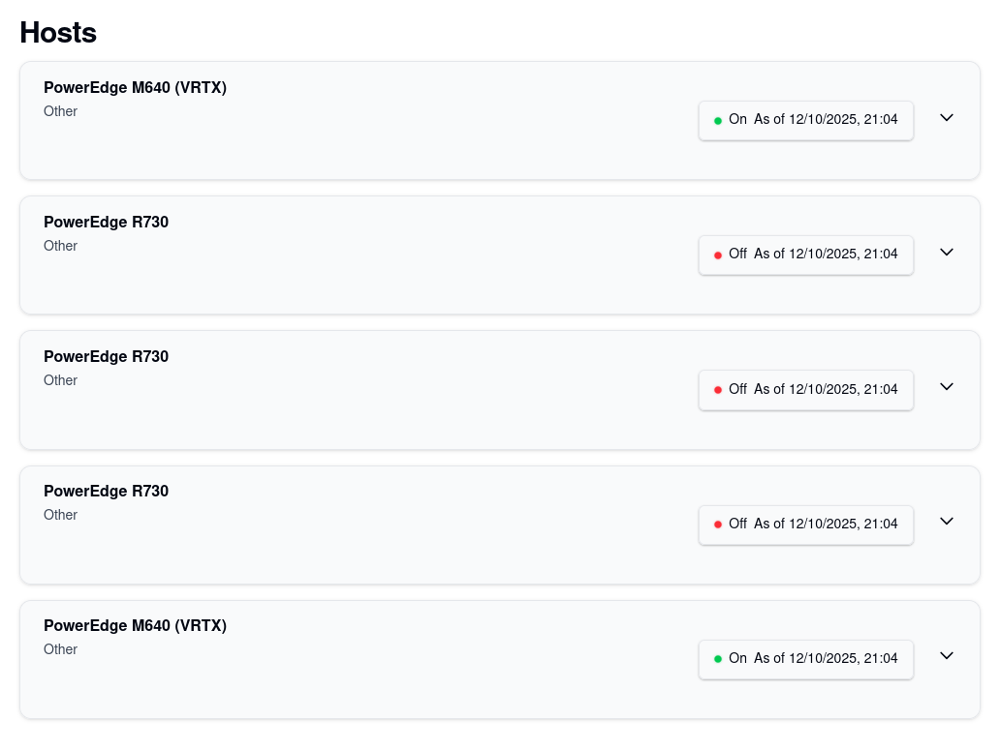

# OPN LaaS Product and Developer Manual

## Final Sprint Recap

### Responsibilities

Below is a breakdown of the responsibilites for the features we worked on during this sprint.

- Feature 1: Resource Dashboard
	- Dan McCarthy
	- Kestutis Biskis
- Feature 2: Virtualization Integration
	- Evan Parker
	- Matt Gee
	- Alex Houle

### Backlog Review

stuff here............

## Developer Documentation

Our project can be accessed at:

- [https://laas.cyber.lab/](https://laas.cyber.lab/)
- **NOTE: This is deployed locally in the Cybersecurity Lab. To access to the site you will need to be on the Cybersecurity VPN.**

Our Github repo and related issues can be found below:

- [https://github.com/OpnLaaS/opnlaas](https://github.com/OpnLaaS/opnlaas)
- [https://github.com/OpnLaaS/opnlaas/issues](https://github.com/OpnLaaS/opnlaas/issues)

### Repository Overview

...

### Running the Project Locally

...

## Testing

### Running Backend Tests

add instructions here:

### Running Frontend Tests

Due to the complexity of some of our frontend features we didn't implement automated testing for them. Below is documentation on how to use the 2 primary features we worked on during this spint.

#### Feature 1: Resource Dashboard

To access the Admin Dashboard first you have to log in as an Admin at /login.

To add new host first you have to click the add new host button then enter an the ip address of the host and select whether it is managed by IPMI or Redfish.

To view hosts go to /hosts 

#### Feature 2: Virtualization Integration