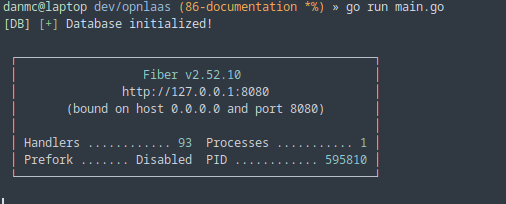
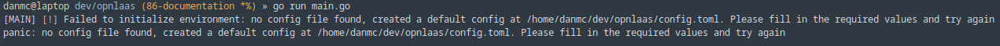

# OPN LaaS Product and Developer Manual

## Final Sprint Recap

Below is a recap of the responsibilities and features covered in our previous sprint.

### Responsibilities

- Feature 1: Resource Dashboard
	- Dan McCarthy
	- Kestutis Biskis
- Feature 2: Virtualization Integration
	- Evan Parker
	- Matt Gee
	- Alex Houle

### Backlog Review

#### Resource Dashboard

| Item                                   | Status        | Discussion |
|----------------------------------------|---------------|-----|
| View existing resources on dashboard   | DONE          | n/a |
| Add new resources to dashboard         | DONE          | n/a |
| Manage resources on dashboard          | DONE          | n/a |

**Github Issues:**

- OPNLaaS #3 (Create landing page)
- OPNLaaS #4 (Create login page)
- OPNLaaS #5 (Create Public Dashboard)
- OPNLaaS #6 (Create Admin Dashboard)
- OPNLaaS #7 (Setup host API on backend)
- OPNLaaS #13 (Setup tailwind on frontend)
- OPNLaaS #28 (Add new website logo)
- OPNLaaS #62 (Improve admin dashboard)

#### Virtualization Integration

| Item                            | Status        | Discussion                                           |
|---------------------------------|---------------|------------------------------------------------------|
| Create virtualized containers   | DONE          | Functional on backend, needs to be added to frontend |
| Add virtualization to frontend  | IN PROGRESS   | n/a                                                  |

**Github Issues:**

- OPNLaaS #20 (Proxmox virtualization integration)
- OPNLaaS #21 (Handle ISO upload)
- OPNLaaS #48 (Add support for PXE boot)
- OPNLaaS #65 (Add virtualization to frontend)

## Developer Documentation

Our project can be accessed at:


- [https://laas.cyber.lab/](https://laas.cyber.lab/)
- **NOTE: This is deployed locally in the Cybersecurity Lab. To access to the site you will need to be on the Cybersecurity VPN.**

Our Github repo and related issues can be found below:

- [https://github.com/OpnLaaS/opnlaas](https://github.com/OpnLaaS/opnlaas)
- [https://github.com/OpnLaaS/opnlaas/issues](https://github.com/OpnLaaS/opnlaas/issues)

### Repository Overview

```
opnlaas
├── app
├── auth
├── config
├── db
├── docs
├── host
├── node_modules
├── public
├── scripting
├── ssh
├── tests
└── vm
```

#### /App

Contains the backend code that immediately talks to the frontend and receives web requests, contains:
- Defined routes on the backend
- Primary functions called by the routes
  - Api routes and views are in separate files
- Any needed middleware for the routes

#### /Auth

Responsible for managing the authentication pipeline between the remote (network) ldap and the browser.
- Contains ability to "inject" a user to become authenticated for testing, but this is not used for production code

#### /Config

Loads, types, and verifies initial configuration values from our config.toml file. 

#### /DB

The database management for our codebase, contains defined database schemas and functions to initialize the local database when the backend starts.

#### /Docs

Your already here!

#### /Host

Software to interface with, and manage hosts; whether they are virtual or physical. 

##### /Host/Iso
Files and scripts for parsing and extracting relevant content from uploaded iso files, these files are then stored to be used when a host is attempting to pxe boot.

##### /Host/PXE
Contains the code to automate the provisioning process of pxe booting a server with an automate install of an operating system. Contains files to run necessary services other than http and templating functions and files in order to create auto-configuration files such as kickstart, autoinstall, and grub commands. 

#### /Public

Contains content served to the browser, including CSS, Javascript, images, and html templates. The content is primarily served from the app directory. 

#### /Scripting

Script utilities that are not run automatically as they server "one time" functionality for developers and maintainers.

#### /SSH

Files for managing ssh connections and keys automatically to allow the backend to create ssh sessions and use them as needed. 

#### /Tests

Contains all of the backend tests for the project, these are running automatically by the github actions runner configured in .github. 

#### /VM

Files for management, creation, and deletion of virtual resources through the Proxmox api to the local proxmox session in the Cybersecurity lab.

## Running the Project Locally

To run the project locally you need to do a few things:

- Clone the git repo
- Install Go and Node.js:
	- `Go` version 1.24.0 or higher
	- `npm` version 10.0.0 or higher
- Setup a `config.toml` file

If all of this is setup you should be able to run the following commmand to setup the frontend:

```
npm run build
```

After that all that is left is running the backend using this command:

```
go run main.go
```

Assuming everything is setup correctly you should see something like this:



### Setting up config.toml

If you run `go run main.go` without having a `config.toml` file setup you should run into the following error:



When this happens a blank `config.toml` will be created that looks like this:

```
[web_server]
    address = ":8080"
    tls_dir = ""
    reload_templates_on_each_render = false
    redirect_server_addresses = []

[ldap]
    address = ""
    domain_sld = ""
    domain_tld = ""
    accounts_cn = "accounts"
    users_cn = "users"
    groups_cn = "groups"
    admin_groups = ["admins"]
    user_groups = ["ipausers"]

[management]
    username = ""
    password = ""
    [management.testing]
        [management.testing.basic]
            enabled = false
            ips = []
        [management.testing.long]
            enabled = false
            ip = ""

[database]
    file = "laas.db"

[proxmox]
    enabled = false
    hostname = ""
    port = ""
    token_id = ""
    secret = "laas-api-token-secret"
    [proxmox.testing]
        enabled = false
        subnet_cidr = "10.255.255.0/24"
        storage = "local-lvm"
        ubuntu_template = "local:vztmpl/ubuntu-22.04-standard_22.04-1_amd64.tar.zst"
        gateway = "10.0.0.1"
        dns = "10.0.0.2"
        search_domain = "local"

[isos]
    search_dir = "./isos_search_dir"
    storage_dir = "./isos"
    testing = false

[pxe]
    enabled = false
    [pxe.dhcp_server]
        address = ":67"
        interface = "eth0"
        server_public_address = ""
        proxy_mode = false
        ip_range_start = ""
        ip_range_end = ""
        lease_seconds = 7200
        subnet_mask = ""
        router = ""
        dns_servers = []
    [pxe.tftp_server]
        address = ":69"
        directory = "/var/lib/tftpboot"
    [pxe.http_server]
        address = ":8069"
        directory = "/var/www/tftpboot"
        public_url = ""

[preconfigure]
    locale = "en_US"
    timezone = "UTC"
    keyboard_layout = "us"
    keyboard_variant = ""
    packages = ["openssh-server"]
    mirror = ""
    root_password = ""
    disable_root = true
    global_kernel_params = []
    global_initrd_params = []
    [preconfigure.managed_user]
        username = "laas-admin"
        password = "laas-admin"
        allow_sudo = true
        ssh_authorized_keys = []
    [preconfigure.given_user]
        username = "laas"
        password = "laas"
        allow_sudo = true
        ssh_authorized_keys = []
    [preconfigure.scripting_file_paths]
        global_pre_script_file = ""
        global_post_script_file = ""
```

Most of this config can be left the same. The **only things you will need to change** are the ldap address/domain, and the management user/password as shown below:

```
[ldap]
    address = "ldaps://domain.cyber.lab:636"
    domain_sld = "cyber"
    domain_tld = "lab"

[management]
    username = "deskguest"
    password = "deskguest"
```

If you are using the Cybersecurity Lab for testing these changes should be enough to get the project running.

## Testing

### Running Backend Tests

add instructions here:

### Running Frontend Tests

Due to the complexity of some of our frontend features we didn't implement automated testing for them. Below is documentation on how to use the 2 primary features we worked on during this spint.

#### Feature 1: Resource Dashboard


To access the Admin Dashboard first you have to log in as an Admin at /login.


To add new host first you have to click the add new host button then enter an the ip address of the host and select whether it is managed by IPMI or Redfish.


To view hosts go to /hosts 


#### Feature 2: Virtualization Integration